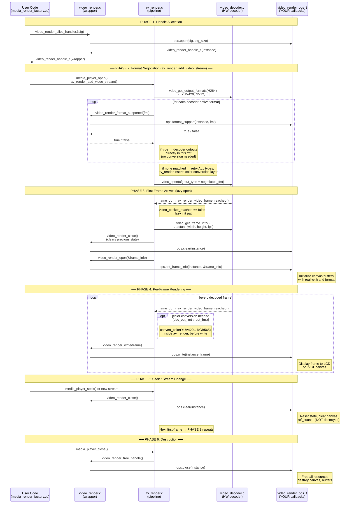

# `video_render_ops_t` — Complete Internal Reference

> **Scope:** `tempotian__av_render` managed component — `video_render.h`, `video_render.c`, `av_render.c`, `video_decoder.c`
>
> **Target:** ESP32-S3, ESP-IDF 5.x, FreeRTOS

---

## Struct Definition

```c
typedef struct _render_video_ops {
    video_render_open_func             open;             // Called once at handle alloc
    video_render_format_supported_func format_support;   // Called N times during format negotiation
    video_render_set_frame_info_func   set_frame_info;   // Called on first frame via video_render_open()
    video_render_get_frame_buffer_func get_frame_buffer; // Called before each decode (zero-copy path)
    video_render_write_func            write;            // Called for every frame to display
    video_render_latency_func          get_latency;      // Optional: AV sync query
    video_render_get_frame_info_func   get_frame_info;   // Optional: dimension query
    video_render_clear_func            clear;            // Called on seek / stream change
    video_render_close_func            close;            // Called at handle destruction
} video_render_ops_t;
```

---

## Lifecycle Flow Diagram



---

## Callback-by-Callback Reference

### `open(void *cfg, int cfg_size) → video_render_handle_t`

| Item | Detail |
|------|--------|
| **Called by** | `video_render_alloc_handle()` |
| **Timing** | Once, at render handle creation — before any stream is opened |
| **Purpose** | Create the backend render instance. Store panel handle, init LVGL reference, alloc static structures. **Do NOT allocate frame buffers yet** — dimensions are unknown. |
| **Return** | Opaque instance pointer (`this` cast to `void*`), or `NULL` on failure |

---

### `format_support(handle, av_render_video_frame_type_t type) → bool`

| Item | Detail |
|------|--------|
| **Called by** | `video_render_format_supported()` ← `get_support_output_format()` ← `av_render_add_video_stream()` |
| **Timing** | During `media_player_open()`, called **multiple times** — once per candidate format |
| **Purpose** | Format negotiation. `av_render` queries the render for each format the hardware decoder can natively output (e.g., H264 can output YUV420/NV12), seeking the **first match**. |
| **Decision tree** | 1. Iterates decoder-native formats. First `true` → decoder outputs in that format, **zero internal conversion**. 2. If no native match → iterates ALL `av_render_video_frame_type_t`. First `true`: if `video_cvt_in_render=false` decoder converts (slower); if `video_cvt_in_render=true` av_render converts internally. |
| **Recommendation** | Return `true` for `AV_RENDER_VIDEO_RAW_TYPE_RGB565` if using LCD. Optionally also `true` for `YUV420` — then av_render handles the conversion. |

---

### `set_frame_info(handle, av_render_video_frame_info_t *info) → int`

| Item | Detail |
|------|--------|
| **Called by** | `video_render_open()` ← `av_render_video_frame_reached()` on **first decoded frame** |
| **Timing** | **Lazy — not at stream open time.** Called when the first actual frame exits the hardware decoder. `info.width/height/fps` are the **real** decoded values, not container metadata. |
| **`info` fields** | `.width`, `.height` — actual frame pixels; `.fps` — frames/sec; `.type` — format negotiated in `format_support` |
| **Purpose** | Initialize display resources: allocate/resize YUV→RGB buffer, create LVGL canvas at exact dimensions, configure DMA lines. |
| **Also called** | After seek/stream change — after `clear` resets state. |
| **Return** | 0 on success. Non-zero → `video_render_open()` fails → stream aborts. |

---

### `get_frame_buffer(handle, av_render_frame_buffer_t *fb) → int` *(optional)*

| Item | Detail |
|------|--------|
| **Called by** | `video_render_get_frame_buffer()` ← `decode_video()` when vdec runs in a **separate thread** |
| **Purpose** | Zero-copy decode: provide a pre-allocated buffer into which the hardware decoder writes its output directly. The buffer is passed as-is to `write()` without memcpy. |
| **When needed** | Only implement if you manage a fixed output buffer (e.g., DMA-capable PSRAM slab). Can return `ESP_MEDIA_ERR_NOT_SUPPORT` or leave `NULL` to use the copy path. |

---

### `write(handle, av_render_video_frame_t *frame) → int`

| Item | Detail |
|------|--------|
| **Called by** | `video_render_write()` ← `_render_write_video()` |
| **Timing** | Every frame, after AV sync decision (may skip a frame if late) |
| **`frame` fields** | `.data` = pixel buffer in negotiated format (already color-converted if needed); `.size` = bytes; `.pts` = timestamp ms; `.eos` flag |
| **Key guarantee** | If `dec_out_fmt ≠ out_fmt` (e.g., decoder outputs YUV420 but render wants RGB565), av_render calls `convert_color()` **before** calling `write()`. You always receive the format declared in `format_support`. |
| **Purpose** | Draw the frame: blit to LVGL canvas, push over SPI, DMA to LCD, etc. Must be fast — called in VRender thread context. |

---

### `get_latency(handle, uint32_t *latency_ms) → int` *(optional)*

| Item | Detail |
|------|--------|
| **Purpose** | Returns the current render pipeline delay in milliseconds. Used by the AV sync engine to compensate display lag. Return 0 if no buffering occurs in the render layer. |

---

### `get_frame_info(handle, av_render_video_frame_info_t *info) → int` *(optional)*

| Item | Detail |
|------|--------|
| **Purpose** | Returns the frame info previously set by `set_frame_info`. Useful when higher layers query current stream dimensions at runtime. |

---

### `clear(handle) → int`

| Item | Detail |
|------|--------|
| **Called by** | `video_render_close()` — triggered on **seek**, **stream change**, or **EOS** |
| **Key distinction** | `clear` ≠ `close`. After `clear`: handle is still alive, `ref_count` decremented but NOT freed. `set_frame_info` will be called again for the next stream segment. |
| **Purpose** | Reset render state: clear canvas to black, reset frame counter, free frame-specific buffers — but keep the instance alive. |

---

### `close(handle) → int`

| Item | Detail |
|------|--------|
| **Called by** | `try_free()` inside `video_render_free_handle()` when `ref_count` reaches 0 |
| **Timing** | Final destruction — called only once, during `media_player_close()` |
| **Purpose** | Free everything: LVGL canvas, PSRAM buffers, color conversion tables, deregister from panel. |

---

## Internal State Machine (`video_render_t.ref_count`)

```
video_render_alloc_handle()  →  ref_count = 1   (open called)
video_render_open()          →  ref_count = 2   (set_frame_info called)
video_render_close()         →  ref_count = 1   (clear called, NOT destroyed)
video_render_free_handle()   →  ref_count = 0   (close called, destroyed)
```

This is why `clear` and `close` are separate: `clear` happens on every seek/stream-end, `close` only on full teardown.

---

## Critical Finding: `format_support` Determines Conversion Location

```
Render supports RGB565, decoder codec = H264:

vdec_get_output_formats(H264) → [YUV420, NV12]
  format_support(YUV420) = false  → skip
  format_support(NV12)   = false  → skip
  → fallback loop:
  format_support(RGB565) = true   → MATCH

if video_cvt_in_render == false (default):
  → cfg.out_type = RGB565
  → decoder does YUV→RGB internally (hardware fast path)
  → write() receives RGB565 directly

if video_cvt_in_render == true:
  → cfg.out_type = YUV420  (decoder native)
  → av_render's convert_color() converts YUV420→RGB565
  → write() receives RGB565 (same result, different conversion path)
```

---

## Call Graph Summary

```
media_player_open()
└── av_render_add_video_stream()
    └── get_support_output_format()
        └── video_render_format_supported()   →  ops.format_support()  [N calls]
    └── vdec_open(negotiated_out_type)

media_player_play()
└── (stream data flows in)
    └── av_render_video_frame_reached()       [first frame only]
        ├── vdec_get_frame_info()
        ├── video_render_close()              →  ops.clear()
        └── video_render_open(&info)          →  ops.set_frame_info()
    └── av_render_video_frame_reached()       [every frame]
        ├── (optional) convert_color()        [if dec_out_fmt ≠ out_fmt]
        └── video_render_write(frame)         →  ops.write()

media_player_seek()
└── video_render_close()                      →  ops.clear()
    (next frame triggers lazy open → ops.set_frame_info() again)

media_player_close()
└── video_render_free_handle()
    └── try_free() when ref_count == 0        →  ops.close()
```

---

## Source Files

| File | Role |
|------|------|
| `managed_components/tempotian__av_render/include/video_render.h` | Public API + `video_render_ops_t` definition |
| `managed_components/tempotian__av_render/src/video_render.c` | Wrapper layer — dispatches to ops vtable |
| `managed_components/tempotian__av_render/src/av_render.c` | Pipeline orchestrator — format negotiation, lazy open, per-frame write |
| `managed_components/tempotian__av_render/src/video_decoder.c` | Hardware decoder wrapper — `vdec_open`, `vdec_decode`, frame callback |
| `managed_components/tempotian__av_render/src/color_convert.c` | Internal YUV420→RGB565 lookup-table converter |
| `main/features/media/media_render_factory.cc` | Project-side factory — registers custom `video_render_ops_t` implementations |
