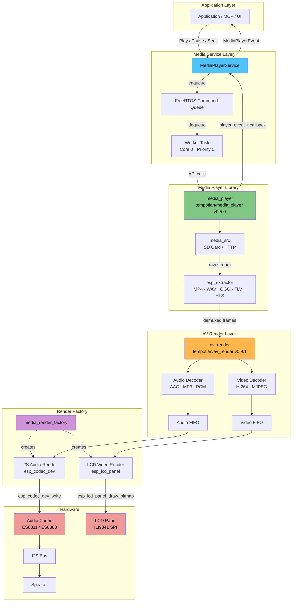
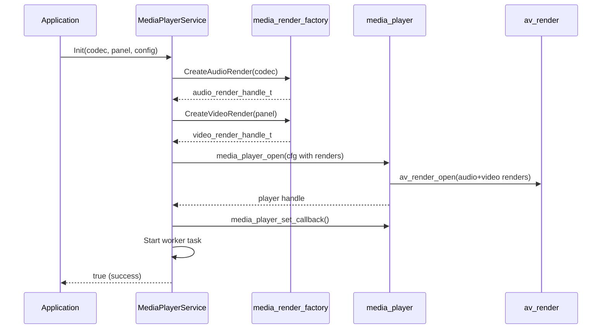

# Media Player Component — Architecture

## Overview

The media component provides MP4 (and other format) playback with audio output
via I2S and video output to an LCD panel. It wraps the `tempotian/media_player`
library behind a thread-safe service layer.

## Block Diagram



## Data Flow

1. **Command path** (top → down):
   `Application` → `MediaPlayerService::Play()` → command queue → worker task
   → `media_player_play()` → media_player library

2. **Media data path** (left → right):
   `SD Card / HTTP` → `media_src` → `esp_extractor` (demux MP4) → `av_render`
   → audio decoder + video decoder → FIFOs → I2S render / LCD render → hardware

3. **Event path** (bottom → up):
   `media_player` callback → `HandlePlayerEvent()` → `MediaPlayerEvent`
   → application listener

## Key Files

| File | Purpose |
|------|---------|
| `media_player_service.h` | Public API: Init, Play, Pause, Seek, SetSource, events |
| `media_player_service.cc` | Command queue, worker task, player lifecycle |
| `media_render_factory.h` | Factory interface for audio/video render creation |
| `media_render_factory.cc` | Creates I2S render and LCD render from board handles |

## Initialization Sequence



## Thread Model

| Task | Core | Priority | Role |
|------|------|----------|------|
| Worker task (`media_svc`) | 0 | 5 | Processes command queue, calls media_player API |
| media_player internal | 1 | — | Demux, decode (managed by library) |
| av_render decode threads | — | — | Audio/video decode into FIFOs |
| av_render render threads | — | — | Drain FIFOs into hardware |

## Usage Example

```cpp
#include "media_player_service.h"

// Get board hardware handles
auto* codec = Board::GetInstance().GetAudioCodec();
auto* display = static_cast<LcdDisplay*>(Board::GetInstance().GetDisplay());

// Configure for MP4 with audio + video
MediaPlayerConfig config;
config.enable_audio = true;
config.enable_video = true;

// Initialize
auto& player = MediaPlayerService::GetInstance();
player.Init(codec, display->GetPanelHandle(), config);

// Set event listener
player.SetEventCallback([](MediaPlayerEvent event, MediaPlayerState state) {
    ESP_LOGI("App", "Event: %d State: %d", (int)event, (int)state);
});

// Play MP4 from SD card
player.SetSource(MediaSourceType::kFile, "/sdcard/video.mp4");
player.Play();
```
