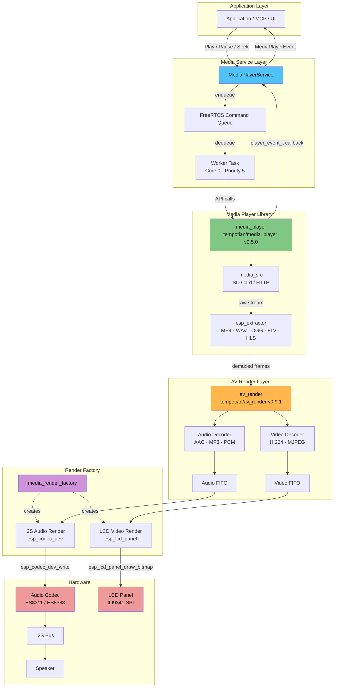
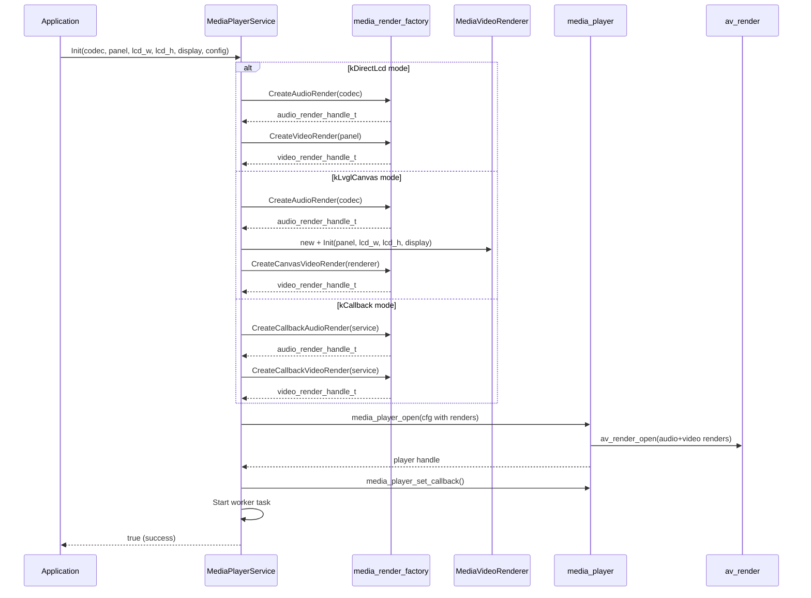

# Media Player Component — Architecture

## Overview

The media component provides MP4 (and other format) playback with audio output
via I2S and video output to an LCD panel. It wraps the `tempotian/media_player`
library behind a thread-safe service layer.

## Block Diagram



## Data Flow

1. **Command path** (top → down):
   `Application` → `MediaPlayerService::Play()` → command queue → worker task
   → `media_player_play()` → media_player library

2. **Media data path** (left → right):
   `SD Card / HTTP` → `media_src` → `esp_extractor` (demux MP4) → `av_render`
   → audio decoder + video decoder → FIFOs → I2S render / LCD render → hardware

3. **Event path** (bottom → up):
   `media_player` callback → `HandlePlayerEvent()` → `MediaPlayerEvent`
   → application listener

## Key Files

| File | Purpose |
|------|---------|
| `media_player_service.h` | Public API: Init, Play, Pause, Seek, SetSource, events, render modes |
| `media_player_service.cc` | Command queue, worker task, player lifecycle, mode-based render creation |
| `media_render_factory.h` | Factory interface for audio/video render creation (hw, callback, canvas) |
| `media_render_factory.cc` | Creates I2S, LCD, callback, and canvas renders from board handles |
| `media_video_renderer.h` | LVGL canvas video renderer (used by kLvglCanvas mode) |
| `media_video_renderer.cc` | Canvas creation/destruction and RGB565 frame-to-canvas drawing |

## Initialization Sequence



## Thread Model

| Task | Core | Priority | Role |
|------|------|----------|------|
| Worker task (`media_svc`) | 0 | 5 | Processes command queue, calls media_player API |
| media_player internal | 1 | — | Demux, decode (managed by library) |
| av_render decode threads | — | — | Audio/video decode into FIFOs |
| av_render render threads | — | — | Drain FIFOs into hardware |

## Usage Example

```cpp
#include "media_player_service.h"

// Get board hardware handles
auto* codec = Board::GetInstance().GetAudioCodec();
auto* display = Board::GetInstance().GetDisplay();
auto* lcd = dynamic_cast<LcdDisplay*>(display);
auto* panel = lcd ? lcd->GetPanelHandle() : nullptr;
uint16_t lcd_w = lcd ? lcd->width() : 0;
uint16_t lcd_h = lcd ? lcd->height() : 0;

// Configure for MP4 with audio + video via LVGL canvas
MediaPlayerConfig config;
config.enable_audio = true;
config.enable_video = true;
config.render_mode = MediaRenderMode::kLvglCanvas;

// Initialize (mirrors VideoPlayer::Initialize pattern)
auto& player = MediaPlayerService::GetInstance();
player.Init(codec, panel, lcd_w, lcd_h, display, config);

// Set event listener
player.SetEventCallback([](MediaPlayerEvent event, MediaPlayerState state) {
    ESP_LOGI("App", "Event: %d State: %d", (int)event, (int)state);
});

// Play MP4 from SD card
player.SetSource(MediaSourceType::kFile, "/sdcard/video.mp4");
player.Play();
```

## Recent Updates (2026-03-08) — Unified Render Mode Architecture

Redesigned MediaPlayerService Init to mirror VideoPlayer's Initialize() pattern,
supporting three render modes via a single comprehensive Init signature.

### What Was Changed

1. **New: `MediaRenderMode` enum** (`media_player_service.h`)
     - `kDirectLcd`:  Hardware av_render — I2S audio + direct LCD panel video
     - `kLvglCanvas`: I2S audio + LVGL canvas video rendering (like VideoPlayer)
     - `kCallback`:   Forward decoded frames to user callbacks

2. **New: `media_video_renderer.h` / `.cc`**
     - `MediaVideoRenderer` class — manages LVGL canvas lifecycle for video
     - `Init(panel, lcd_width, lcd_height, display)` — mirrors VideoPlayer init params
     - `OnVideoInfo()` / `OnVideoFrame()` — receives decoded RGB565 from av_render
     - `CreateCanvas()` / `DestroyCanvas()` — PSRAM-backed LVGL canvas in display lock
     - Centers video frame on LCD (same algorithm as `VideoPlayer::DrawFrameToCanvas`)

3. **Updated: `media_player_service.h`**
     - New Init signature: `Init(codec, panel, lcd_width, lcd_height, display, config)`
     - `MediaPlayerConfig::render_mode` field added (default: `kDirectLcd`)
     - New members: `display_`, `lcd_width_`, `lcd_height_`, `internal_renderer_`
     - Kept callback-only `Init(config)` for backward compatibility

4. **Updated: `media_player_service.cc`**
     - `InitInternal()` now uses `switch(render_mode)` for render creation:
       - `kDirectLcd`: I2S audio + LCD video (original hardware path)
       - `kLvglCanvas`: I2S audio + canvas video via `MediaVideoRenderer`
       - `kCallback`: callback audio + callback video (user callbacks)
     - `Deinit()` cleans up `internal_renderer_`

5. **Updated: `media_render_factory.h` / `.cc`**
     - Added `CreateCanvasVideoRender(MediaVideoRenderer*)` factory function
     - Added `CanvasVideoCtx` vtable implementation (forwards to renderer)

6. **Updated: `application.cc` `InitMedia()`**
     - Passes `lcd_width`, `lcd_height`, `display` to `Init()`
     - Uses `kLvglCanvas` mode when LCD display available

### Render Mode Comparison

| Mode | Audio | Video | Use Case |
|------|-------|-------|----------|
| `kDirectLcd` | I2S (codec) | Direct LCD panel | Maximum FPS, no LVGL overhead |
| `kLvglCanvas` | I2S (codec) | LVGL canvas widget | UI overlays on video, LVGL refresh |
| `kCallback` | User callback | User callback | Custom external rendering |

---

## Previous Updates (2026-03-07)

The media component was updated to support AVI-style user rendering callbacks,
so applications can render audio/video externally instead of using internal
I2S/LCD renderers.

### What Was Changed

1. `media_player_service.h`
     - Added render callback typedefs:
         - `media_audio_frame_cb_t`
         - `media_audio_set_clock_cb_t`
         - `media_video_frame_cb_t`
         - `media_video_set_info_cb_t`
         - `media_play_end_cb_t`
     - Added `MediaRenderCallbacks` config struct.
     - Added `MediaPlayerConfig::callbacks` to enable callback-render mode.
     - Added `GetCallbacks()` accessor for internal render dispatch.

2. `media_render_factory.h`
     - Added callback render factory APIs:
         - `CreateCallbackAudioRender(MediaPlayerService*)`
         - `CreateCallbackVideoRender(MediaPlayerService*)`

3. `media_render_factory.cc`
     - Implemented custom av_render vtable-based callback renderers.
     - Audio callback render forwards decoded PCM frames and clock info to user callbacks.
     - Video callback render forwards decoded frames and video frame info to user callbacks.
     - Retained existing hardware render factories (`CreateAudioRender`, `CreateVideoRender`).

4. `media_player_service.cc`
     - Updated render selection logic:
         - If callback is set, use callback render.
         - Otherwise use internal hardware render (I2S/LCD) if handles are provided.
     - Added EOS handling to call `play_end_cb` (AVI-style end callback behavior).

### Behavior After Update

- **Internal render mode (old behavior):**
    Uses `AudioCodec + esp_lcd_panel_handle_t` and renders inside media module.

- **Callback render mode (new behavior):**
    Decoded frames are delivered to app-level callbacks for custom rendering/audio output.

### Callback Mode Example

```cpp
MediaPlayerConfig cfg;
cfg.enable_audio = true;
cfg.enable_video = true;

cfg.callbacks.audio_clock_cb = [](uint32_t rate, uint8_t bits, uint8_t ch, void* ctx) {
        // Similar to AviAudioClockCallback
};
cfg.callbacks.audio_cb = [](const uint8_t* data, int size, uint32_t pts_ms, void* ctx) {
        // Similar to AviAudioCallback
};
cfg.callbacks.video_info_cb = [](uint16_t w, uint16_t h, uint8_t fps, uint8_t type, void* ctx) {
        // Video format notification
};
cfg.callbacks.video_cb = [](const uint8_t* data, int size, uint16_t w, uint16_t h, uint32_t pts_ms, void* ctx) {
        // Similar to AviVideoCallback
};
cfg.callbacks.play_end_cb = [](void* ctx) {
        // Similar to AviPlayEndCallback
};

MediaPlayerService::GetInstance().Init(cfg);
```
